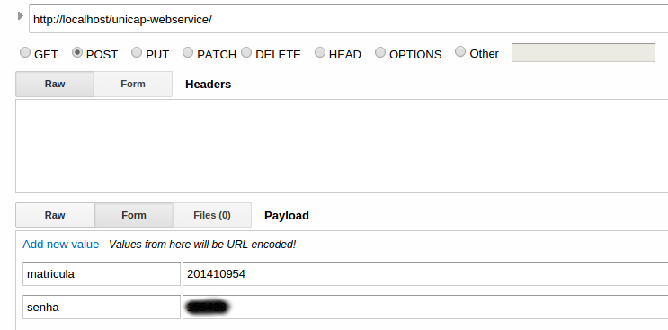

# unicap-webservice
Webservice para consultar dados dos alunos da UNICAP.
Codificação feita em PHP, com retorno de dados em JSON.
Para usar instale o PHP 5.3 ou maior, Php5-curl.
##Sugestão para visualizar os dados
Usando Advanced Rest Client (google chrome app)
[Instalar aplicativo](https://chrome.google.com/webstore/detail/advanced-rest-client/hgmloofddffdnphfgcellkdfbfbjeloo?utm_source=chrome-ntp-icon)

##Exemplo de dados:

#####Fork me and contribute.